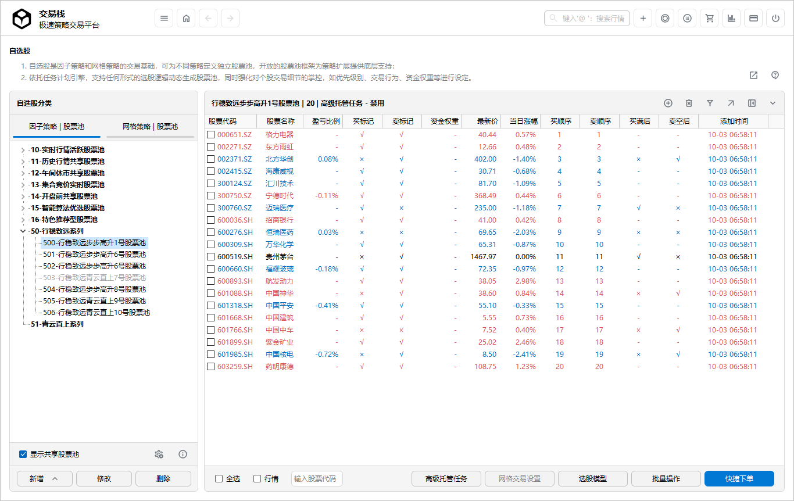
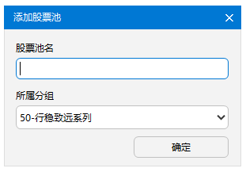
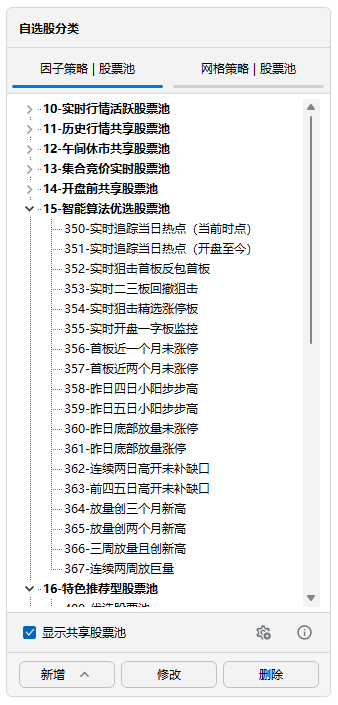
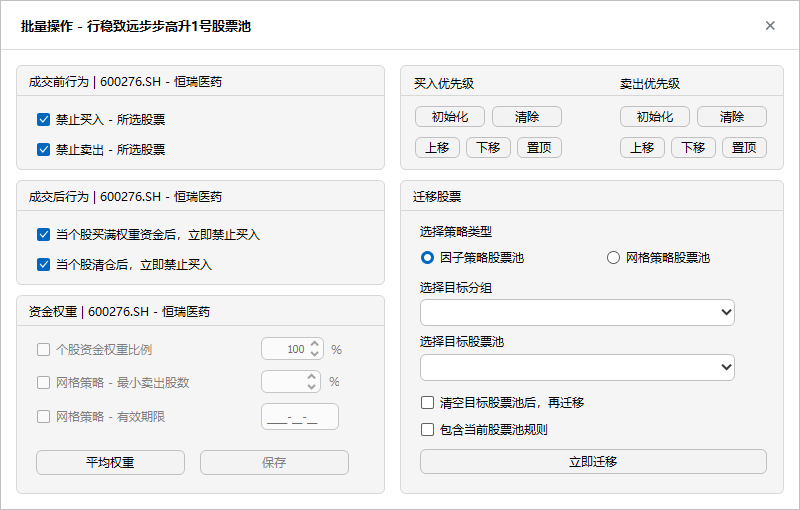
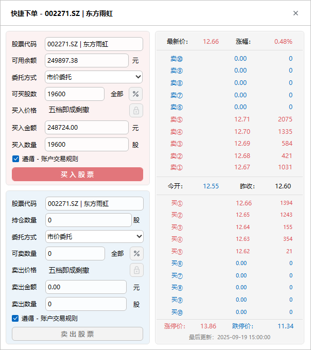

# 自选股

> 自选股：自选股是**因子导向策略**和**价格导向策略**交易标的的基础，可针对不同策略定义不同的股票池。

- 支持因子导向策略-股票池与价格导向策略股票池单独管理；
- 支持股票池的动态生成；
- 支持选股模型的自动任务导入或手工导入；
- 支持股票买卖优先级别的设定；
- 支持股票的买卖交易行为的设定；
- 支持股票资金权重的设定；
- 支持自定义板块设计；
- 支持离线委托计划下单；
- 支持设计以价格为基础的网格交易模型；
- 支持任务计划对自选股参数进行盘中、盘后动态调整；
- 支持股票池的各种条件过滤，迅速进行操作或批量操作；
- 支持股票池的迁移或包含规则的迁移。

## 股票池的建立

1. **添加股票池分组**：分组的命名最好是XX系列，方便管理，也和策略定义、因子库的XX系列对应，点击**添加分组**； 
	
	
2. 输入分组名称，点击**确定**；这是界面树形结构根目录出现新增的致远量化系列分组；选中该分组，点击**添加小类**； 
	
	
3. 至此，股票池的名称定义好，接下来定义股票池所包含的股票。

>*说明：当需要删除股票池分组时，如当前分组包含股票池，则无法删除；名称后缀自动加上“股票池”。*

## 平台共享股票池
1. 平台共享股票池是指平台根据一定的规则自动生成的股票池，包括实时行情的规则股票池，也包括历史行情生成的股票池；
2. 勾选**显示平台共享股票池**，则系统将会显示； 
	

3. 平台共享股票池的使用：点击**批量设置**，勾选所需的股票，然后选择用户自建的股票池，点击**立即迁移**即可；
4. 右击所需股票，弹出菜单，选择【发送到其他股票池】，可直接单只股票迁移；

## 添加股票

1. **手动添加股票**：选中股票池，点击**快速添加股票**，系统弹出添加股票界面； 
	
2. 在添加股票界面，说明如下：
   - **股票列表**：股票列表的板块设置由系统生成标准板块，用户可自定义板块，在**扩展证券板块**中设置；
   - **过滤股票**：输入关键字过滤板块中股票；
   - **基本条件过滤**：系统提供简单的过滤条件供用户使用；更为复杂的选股方法请使用选股模型来设定；
   - **剔除ST股票**：不显示ST股票；
   - **是否龙头股**：由**扩展证券板块**设置，用户根据需要定义龙头股；
   - **剔除上市少于N天**：上市天数少于设置值的股票将不会显示；
   - **流通盘**：系统将显示流通盘在设定区间的股票；
   - **市盈率**：系统将显示市盈率在设定区间的股票；
   - **选择条件为并且的关系**：板块、关键词过滤、剔除ST股、是否龙头股、剔除上市天数、流通盘以及市盈率属于并且的关系，即同时满足条件；
3. 勾选目标股票，点击**添加至自选股**； 
4. **直接股票**：与一般行情软件一致，输入代码或拼音；

## 批量设置
选中股票池，点击批量设置进入界面： 

1. **买卖行为**：对一只或多只股票进行交易行为的控制； 
    
2. **个股规则**：针对个股的有效期限、资金权重以及最小卖出股数进行设定；其中有效期限仅对**价格导向策略**有效 
	 
3. **迁移当前勾选股票**： 
	
	- **迁移至股票池**：迁移到当前自选股中的其他股票池子；
	- **迁移至板块定制**：迁移到板块定制，作为板块公共池子；
	- **迁移方式**：替换目标股票池股票为先删除目标股票池股票，然后添加；追加目标股票池为不删除，然后添加；
	- **包含规则**：迁移包含当前股票池规则，规则包括：买卖行为和买卖优先级；
4. **优先级设置**： 
	
	- **初始化优先级**：第一次使用优先级，先进行优先级初始化；买卖优先级分开处理；
	- **调整优先级**：通过上移、下移及置顶按钮，可调整优先级； 
5. 其他设置：主要对当前股票池的板块进行关联，比如说概念板块，地域板块等，用户自定义板块也可显示，如持仓盈利板块、亏损板块等。 
	

>*说明：买卖行为的设置与交易规则中的交易行为设定不冲突，交易行为是全局性的买卖行为，而此处是交易账户向下的个股的交易行为；买卖行为、优先级可通过计划任务动态设置。 很多实际应用场景下，自选股池子需要替换股票或追加股票，但需对新生成的股票池子进行比对审核，可建立专门股票池存放临时可选股票，市场时机成熟时追加或替换股票池。*

## 条件过滤

1. **持仓过滤**：分为当前持仓、未持仓；
2. **交易行为过滤**：分为允许买入、禁止买入、允许卖出、禁止卖出的交易行为过滤；
3. **过滤后批量操作**:，过滤后进行批量操作，加快处理效率；
4. **所属概念板块**：对当前的股票池匹配是否在概念板块中；
5. **复**：清除过滤条件。

## 人工交易

1. 分为买入方向和卖出方向：选中股票池中的股票，即可进行买卖；
2. 忽略交易规则：不按照预设的交易规则处理买卖行为；
3. 遵循交易规则：按照预设的交易规则处理买卖行为，交易按钮如果是灰色，说明在当前交易规则下股票无法操作；
4. 金额动态显示：可用金额、可买数量、预估金额、买入数量均随行情变化而动态显示；
5. 委托方式：分为市价委托和现价委托；
6. 买卖比例：点击率按钮，可按照一定比率进行买卖操作，系统自动进行计算买卖金额和股数； 

7. 锁定委托档位：点击锁按钮，可设定从买10至卖10档位的价格进行交易；
8. 保持锁定买入比例：指所有股票的操作均按照设定的买卖比例进行操作；
9. 保持锁定价格设定：指所有的股票的操作均按设定的锁定档位价格进行操作；

>*人工交易：除因子导向策略和价格导向策略的另外一个交易通道；与策略自动交易方式不同的是，该通道属于手动交易；*

## 网格交易设置

1. **买入触发价格**：系统提供四批次设定买入价格区间，让用户可进行触发交易；
2. **卖出触发价格**：系统提供四批次设定卖出价格区间，让用户可进行触发交易；
3. **批次可自由指定**：用户可自由指定买卖批次；
4. **买卖权重**：支持设置买入资金的批次比重；支持设置卖出股数的比重；
5. **有效期**：支持设置网格交易的有效期；
6. **快捷录入价格**：第一种方式，点击行情价格，即可快捷输入某一批次的第一个价格，第二个价格自动生成；第二种方式，点击【价】按钮，系统根据昨日收盘价进行百分比进行自动输入；

>*资金的分配比例、股数的分配比例系统自动动态生成， 对应用户而言，只需关注资金的规划和市场的走势，甚至交易的价格既可以有系统自动生成 最佳配置；这是以价格为导向的盘中T+0利器。*

## 导入选股模型

1. **导入选股模型**：选中股票池，点击**导入选股模型**，系统弹出添加可用的选股模型界面，包含当前存在的选股模型； 
	
	
2. 选中模型名称，点击**立即导入**；这样自选股即可添加选股模型规则下的一批股票：

3. **选股模型来源**：选股模型来源于投研分析板块中->生成分析模型->输出至选股模型；一般以固定模型居多； 

4. **选股模型自动添加至股票池**：通过选股模型->设定任务->按照盘中、盘后任务组->设定频率自动添加；无需人员干预；

5. **替换目标股票池**：勾选该按钮，将清空目标股票池，然后添加；默认为追加，不删除目标股票池；

6. **已购买股票处理**：无论是自动任务，还是手工添加，均无法清除已购买股票；

>*选股模型是一系列规划和分析思路的仓库；与快速添加股票不同的是，模型股票均由分析模型根据不同的逻辑生成；不同的投资者都有自身个性化的研究方向，系统支持相关人员设计出符合自身需要的模型，手工导入或以任务计划的形式自动导入。*
