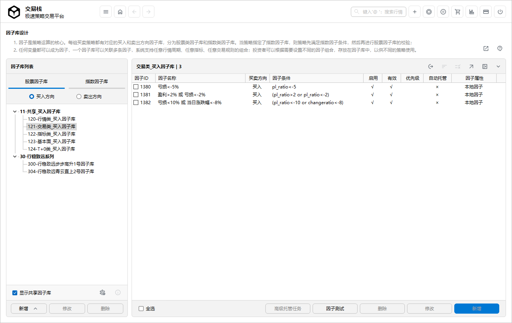
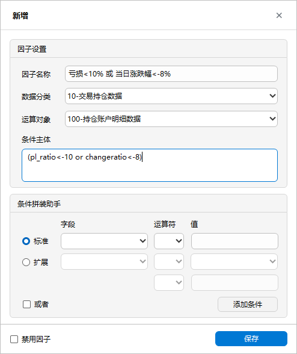

# 因子库设计

>*因子设计：因子是策略运算的核心，一个因子库可对应多条因子，系统支持任意行情周期、任意指标、 任意交易规则的组合；基金经理可设置不同的因子组合，放在因子库中，供不同的基金策略使用。*

- 无论是基本面数据、高频数据还是交易数据等，一切的变量均可成为因子；
- 因子库分为两大类：一类是股票类因子，一类是指数类因子；
- 买入方向和卖出方向因子库单独定义；
- 因子库中的因子可无限叠加；支持多周期、多因子灵活组合；
- 因子库因子的优先级设置，确保策略运算的效率；
- 支持因子库的测试与迁移；

## 分组与因子库

1. **添加因子库分组**：因子库分组的命名最好是XX系列，方便管理，也和策略定义、自选股池子的XX系列对应，点击**添加分组**； 
2. 输入分组名称，点击**确定**；这是界面树形结构根目录出现新增的致远量化系列分组；选中该分组，点击**添加因子库**； 
3. **添加因子库**：系统默认选择选中分组，输入**因子库名称**；然后点击**确定**；这样一项因子库的名称定义好，接下来定义因子库所包含的内容。

>*说明：当需要删除因子库分组时，如当前分组包含因子库，则无法删除；因子库名称后缀自动加上“因子库”。*

## 平台共享因子库
1. 平台共享因子库是指平台提供的一些通用的因子库；
2. 勾选**显示平台共享因子库**，则系统将会显示； 
3. 平台共享因子的使用：点击**批量设置**，勾选所需的因子，然后选择用户自建的因子库，点击**立即迁移**即可；

## 添加因子

1. **添加因子**：选中树形目录的因子库，点击**添加因子**； 
	
2. 在该界面，因子的属性说明如下：
   - **停用因子**：保留因子，但不参与运算；
   - **买卖方向**：如因子设计主界面选中买入方向，则该因子的方向自动为买入方向；
   - **数据分类**：**因子数据**的分类，包括实时、高频、交易类等数据分类
   - **运算对象**：该因子运算依赖的数据表；因子的运算对象来自于用户自定义测量库，通过**因子数据**导入数据源；
   - **运算对象可视范围**：当添加股票类因子，则运算对象仅显示股票类运算对象；在**因子数据**导入界面中设置数据来源属性；
   - **设置条件**：分两种，一种是标准的运算条件；一种是稍微复杂的运算条件；
   - **多个条件**：同一运算对象可生成多个条件，默认是and，如需or，勾选**或者**
   - **条件主体**：点击**添加**，系统自动生成条件语句；
   - **动态设置条件**：条件主体可自行编写，是一个开放的接口；可在任务与计划当中，按照任务频率自动设置条件主体；
3. 输入因子名称，点击**保存因子**；一条新的因子生成。 

## 因子测试
1. 当一条因子设计完成，为了保证因子能够正式投入到实战使用；系统提供因子测试工具；
2. 选中因子库，点击**因子测试**，立即对当前因子库所有的因子进行检查，检查通过后方可投入使用；
2. 因子处于灰色显示状态，说明该因子被禁用或测试未通过。

## 优先级设置
1. 在使用优先级之前，先点击**初始化优先级**，系统根据因子ID顺序排序并赋予优先级编号；
2. 手动调整优先级，点击**⋀上移**、**∨下移**按钮；
3. 策略在执行时，约靠前的因子优先运算，如果条件成立，接着运算下一条因子，遇到条件不成立，立刻中断运算，等待下一轮；

>*说明：提升运算性能技巧：把最严格的参数条件调至最高优先级。*

## 批量操作

1. **因子迁移**：将当前因子库中的所有因子迁移至目标因子库；
2. **迁移方式**：一种是追加方式，目标因子库保持不变，新增当前因子库所有因子；一种是替换方式，目标因子库因子清除，新增当前因子库所有因子；
3. **操作**：选择目标因子库分组和目标因子库，视情况勾选替换目标因子库，点击**立即迁移**；
4. **因子设置**：勾选主界面的因子，批量快速启用和禁用因子。
