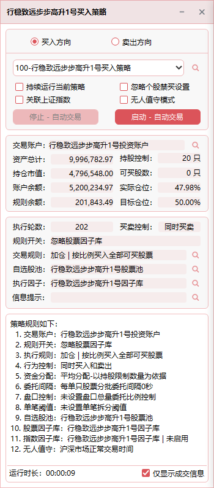

## 启动因子策略

> 因子策略：以因子为核心驱动，结合交易规则、逻辑、买卖方向因子库、指数关联和股票池等要素，动态组合形成的综合策略执行体系。

- 全自动量化交易的载体，任何投资决策思想及资金规划均可在因子导向策略中执行；远程操作手机终端即可完成策略的设定和更新；
  
- 将正式交易和仿真交易合二为一，仿真环境与实盘一致，与市场同步实盘校验策略的可行性，从而改善策略的盈利能力；
  
- 启动实例后，均以高速公路换轮胎的方式，无需停止，即可在线进行股票池、资金仓位、因子参数、以及指数联动等各种更新工作；

具体功能包括：策略买卖方向选择、策略参数设置、交易账户实时动态监控、策略执行状态跟踪，以及完整的执行日志记录。

   
  

## 策略的买卖方向和选择

   

- **隔离的买卖实例**：因子策略将买入与卖出分为独立实例。比如勾选“买入方向”后，下拉框仅显示对应的买入策略。

- **多实例启动**：如需同时运行多个策略，可开启多个因子策略窗口，每个实例由独立线程处理，互不干扰。

- **策略列表**：下拉列表框可显示所属人员可执行的因子策略；策略列表支持权限控制，操盘手仅能执行有权限的策略。

- **持续运行当前策略**：
  - 策略启动后将持续保持运行状态，实时监控行情与策略条件是否匹配，一旦匹配则自动下单，直到人工停止。  
  - 当下拉选择策略时，如果交易规则中勾选了“忽略因子与价格条件”且高级委托未设置，则默认不勾选；其他情况默认为勾选。

- **忽略个股禁买/卖设置**：
  - 默认行为：当股票池中某只股票被设置为禁买时，即使策略条件满足，该股票也不会被下单。
  - 勾选忽略禁买：如果勾选此选项，则策略将忽略个股的禁买规则，允许下单。

- **关联指数**：
  - 选项可与无人值守模式联合使用，最大程度让策略随市场变化而做出相应的调整；勾选“关联指数”后，策略将在满足指数因子库的前提下，再对股票条件进行运算。  
  - 指数因子库：股票的买卖行为需先满足指数设定的条件才能进行交易；在 [ 因子库设计 ](./Factor_Library_Design.md)  中定义。
  - 指数联动：交易账户仓位和买卖行为根据关联指数设定的压力支撑位的参数变动而变动；在 [ 指数联动 ](./Index_Linkage.md)  中设置。
    
- **无人值守模式**：勾选此选项后，系统将在 10 秒后自动启动策略执行，并持续运行，直至人工干预。  

- **自动写入执行日志**：策略停止运算时，系统会将当前交易日的所有交易行为写入文本文件，存放于 `Logs` 目录。无人值守模式同样适用。  

- **启动 - 自动交易**：策略将根据策略定义的所有规则进行运算，满足条件后执行委托操作，并获取券商返回的交易状态。  

- **停止 - 自动交易**：策略将立即停止运算和交易。

> 说明：当策略启动后，勾选了无人值守模式，则系统自动进行交易日的切换。

## 资金及仓位情况

## 策略的执行状态

## 策略执行日志
