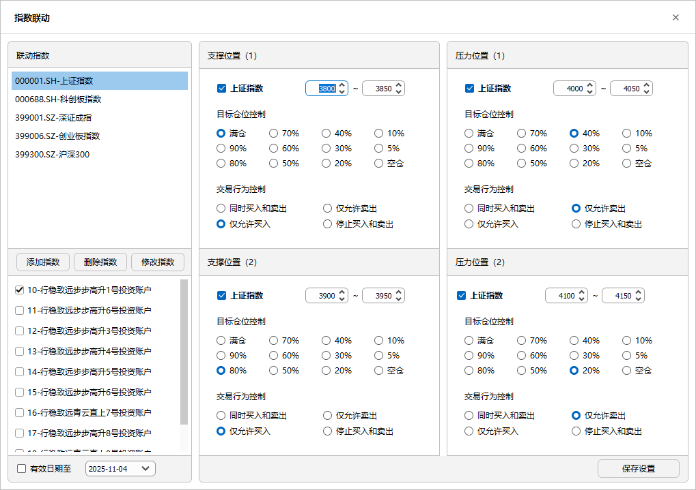
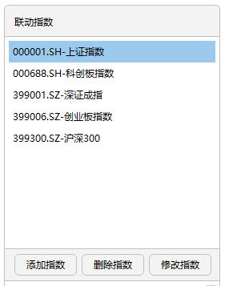
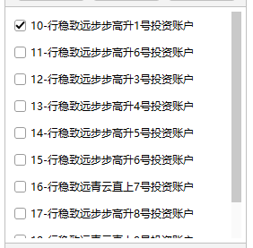

# 指数联动

> 指数联动旨在满足指数条件下，对相应个股交易进行风险控制，主要体现在 [ 仓位控制 ](./Trading_Rules.md#目标仓位控制) 和 [ 交易行为控制 ](./Trading_Rules.md#交易行为控制)。  
> 通过设定不同指数对应的资金账户，可阶段性调整资金账户在不同市场环境下的交易规则。

---

## 新增、修改与删除指数

1. **添加指数**：输入指数代码和指数名称。  
2. **修改与删除指数**：  
   - 修改操作仅可修改指数名称，不能修改代码；  
   - 删除指数将清除该指数及其关联的交易账户。  
3. 指数可选择沪深标准指数，也可自定义指数。自定义指数代码需在 [ 策略定义 ](./Strategy_Definition.md) 模块的策略库中存在。

---

## 定义支撑位行为

1. **定义支撑区间**：输入对应指数的支撑位置区间。当勾选“关联指数”的策略启动后，系统将持续匹配该支撑区间，以决定是否调整目标仓位或交易行为。  
2. **目标仓位**：可根据个人偏好设定目标仓位。  
3. **交易行为控制**：可根据个人偏好设定交易行为。  

> 当策略执行勾选 **关联指数** 时，[ 交易规则 ](./Trading_Rules.md) 中的目标仓位和交易行为设置将失效，以本模块设定为准。  
> 为确保支撑位置有效，请确保支撑位置①与支撑位置②数值不重叠。

---

## 定义压力位行为

1. **定义压力区间**：输入对应指数的压力位置区间。当勾选“关联指数”的策略启动后，系统将持续匹配该压力区间，以决定是否调整目标仓位或交易行为。  
2. **目标仓位**：可根据个人偏好设定目标仓位。  
3. **交易行为控制**：可根据个人偏好设定交易行为。  
4. **重要说明**：当策略执行勾选 **关联指数** 时，[ 交易规则 ](./Trading_Rules.md) 中的目标仓位与交易行为设置将失效，以此处为准。  
   为确保压力位置有效，请确保压力位置①与压力位置②数值不重叠。

---

## 指数关联交易账户

1. **指数一对多**：一个指数可对应多个基金账户。  
2. **策略定义设置**：在此定义指数与基金关系后，还需在 [ 策略定义 ](./Strategy_Definition.md) 中指定是使用 [ 指数联动 ](./Index_Linkage.md) 还是 [ 指数因子库 ](./Factor_Library_Design.md)。

---

## 设置有效期

- **有效期设置**：为了保证指数能持续有效地辅助策略执行，需要为指数设置有效期。  
  过期后，若策略执行时仍勾选“关联指数”，系统将提示指数失效。  

> 除了 [ 指数联动 ](./Index_Linkage.md)，在 [ 因子库设计 ](./Factor_Library_Design.md) 中同样可以设置指数因子的买入与卖出方向，详见后续章节。
