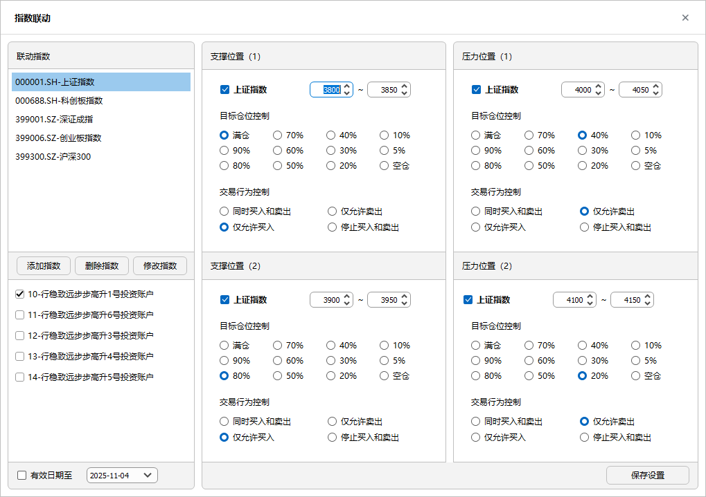

# 指数联动

- **定义**：旨在满足指数的条件下，对相应的个股交易进行风险的控制，主要体现在仓位控制、交易行为控制；
- **目的**通过设定不同指数对应的交易账户，可阶段性对资金账户所处的市场大环境进行交易规则的调整，达到策略执行效益的最大化；

  

## 新增修改删除指数
 
- **添加指数**：输入指数代码、指数名称；
- **修改指数**：修改只能修改指数名称，不能修改代码；
- **删除指数**：删除指数将清除指数及关联交易账户设置；
- **自定义指数**：指数可用沪深标准指数，也可自定义指数，需要注意的是指数代码需在策略库中存在；

## 定义支撑位行为

- **定义支撑区间**：输入对应指数支撑位置区间；当勾选关联指数的策略启动后，系统将不断匹配该支撑位置的区间决定是否进行目标仓位和交易行为的调整；
- **目标仓位**：用户可根据个人偏好进行目标仓位的设定；
- **交易行为控制**：用户可根据个人偏好进行交易行为的设定；
> 当策略执行勾选**关联指数**，交易规则中的目标仓位和交易行为设置将失效，以此处为准；为了保证支撑位置的有效性，请确保支撑位置①与支撑位置②数值不重叠。

## 定义压力位行为

- **定义压力区间**：输入对应指数压力位置区间；当勾选关联指数的策略启动后，系统将不断匹配该压力位置的区间决定是否进行目标仓位和交易行为的调整；
- **目标仓位**：基金经理可根据个人偏好进行目标仓位的设定；
- **交易行为控制**：基金经理可根据个人偏好进行交易行为的设定；
- **重要说明**：当策略执行勾选**关联指数**，交易规则中的目标仓位和交易行为设置将失效，以此处为准；

> 当策略执行勾选**关联指数**，交易规则中的目标仓位和交易行为设置将失效，以此处为准；为了保证压力位置的有效性，请确保压力位置①与压力位置②数值不重叠。

##  指数关联交易账户

- **指数一对多**：指数可一对多的指定交易账户；
- **策略定义设置**：此处定义好指数与交易账户的关系后，还需在策略定义中指定是指数联动还是使用指数因子库；

## 设置有效期

- **有效期**：为了保证指数能够真正帮助到策略的执行，需要设置指数有效期；
- 过了有效期后，策略执行即使勾选了关联指数，会弹出失效信息；

> 指数条件除了指数关联外，在因子设计中，也存在指数因子买卖方向因子设计，在 [因子库设计](./Factor_Library_Design.md) 中定义。  
