# 模型分析

- **全局模型分析**：建立新的模型统计分析，分析维度最多，过滤条件最多，数据统计范围全覆盖；属于父级模型对象；
- **模板模型分析**：模板模型由用户点击**另保为模板模型**后生成，主题对象和主题指标由用户自行生成，衍生于全局模型对象 但又独立于全局模型；
- **固定模型分析**：固定模型由用户点击**另保为固定模型**后生成，主题对象和主题指标由用户自行生成，衍生于全局模型对象, 但又独立于全局模型；

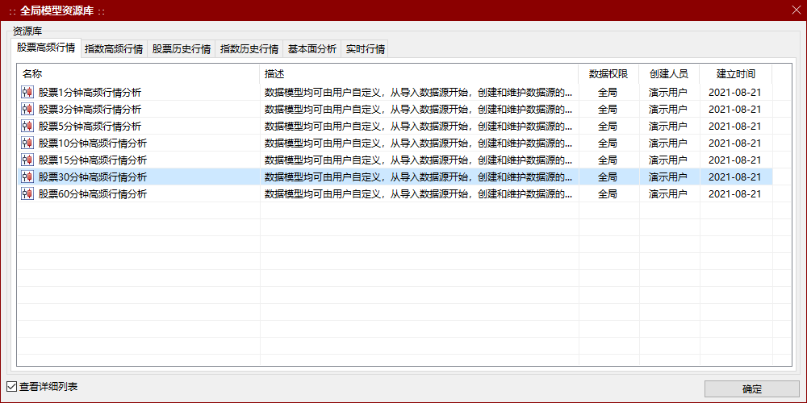

>*数据权限：资源库中全局模型对象根据分组设定好分类，分类由系统管理员或基金管理人员设定；凡是系统管理员生成的全局模型对象都会显示在资源库中；如设置了单位数据权限，则模型只能查看所属单位的数据，无法查看其他单位数据；*

<!-- tabs:start -->

#### ** 全局模型 **

## 全局模型

1. **新建全局模型**：点击**投研分析-全局模型**，选定一张模型后，点击**确定**，即可进入该模型对象的主题界面； 

   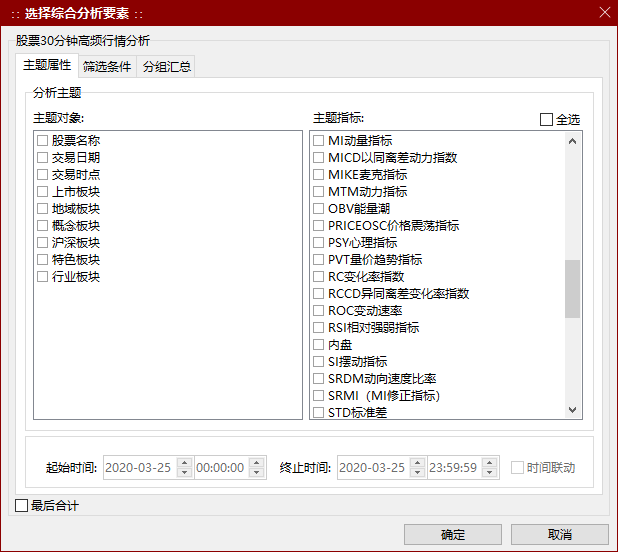

2. **选择综合分析要素**：界面由三大块组成：主题属性、筛选条件、分组汇总，分别决定了统计分析的结果；

3. **分析主题**：通俗意义上的统计项，系统自动区分不可计算的统计项（主题对象）和可计算的统计项（主题指标）；分析主题由系统管理员或基金规划专家设计，分析主题数目不限，可无限扩展；

4. **勾选及显示**：分析主题勾选哪些，统计结果就会显示哪些统计项的结果；

5. **统计时间**：比如该处是交易时间，统计口径由系统管理员或基金经理设定，可设定任何统计时间口径；

6. **筛选条件**：凡是分析主题都可以进行筛选；用户掌握数据的自主性和灵活性；筛选条件分为**固定代码条件**和**自定义条件**；

   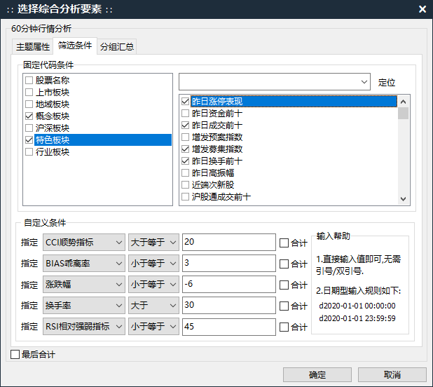

   - **固定代码条件**：指比如单位、产品、股票、渠道等具备唯一编号的、可区分属性的统计项；
   - **自定义条件**：指无唯一编号的统计项，如涨跌幅、各项指标、金额等

7. **定位**：可输入中文，也可输入代码，快速定位所需筛选内容；

   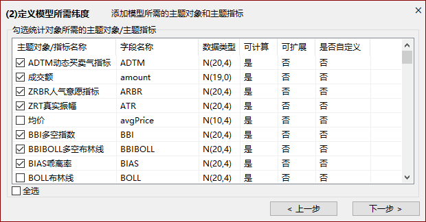

8. **自定义条件**：除固定代码条件之外的主题对象和主题指标均会显示在下拉框中，可进行大于、 大于等于、小于、小于等于、等于、包含等过滤条件；直接输入值即可，无需引号或双引号；日期型输入规则为：比如某天的 0 点 0 时 0 分，则输入 d2020-01-01 00:00:00，注意一定要在日 期前加上 d；为了方便输入，双击示例即可复制日期格式，然后粘贴到输入框；

9. **取消某一自定义条件**：删除值即可，过滤条件将自动消失；

10. **自定义条件的合计**：是指该筛选条件的统计结果进行合计；

11. **分组汇总**：指对勾选的主题对象进行汇总处理，默认在统计结果中对选择的主题指标进行求和处理；选择主题对象名称，然后点击分组汇总按钮即可，如需取消，则点击不分类汇总；勾选主题对象后方可可以进入分组汇总界面，否则将无法进入；

    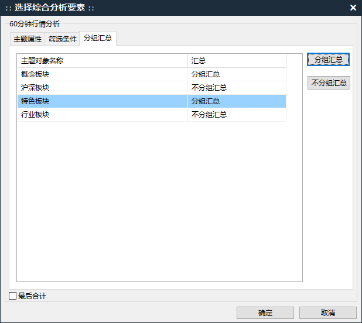

12. **最后合计**：对统计结果进行主题指标的求和；对于其他的平均值、最大值、最小值、计数等，由系统管理员或市场分析人员在管理界面设定，一般用户勾选使用即可，简单方便；

13. **生成数据**：完成所需的勾选操作后，点击确定即可提交给服务器进行计算，等待统计结果的生成；

    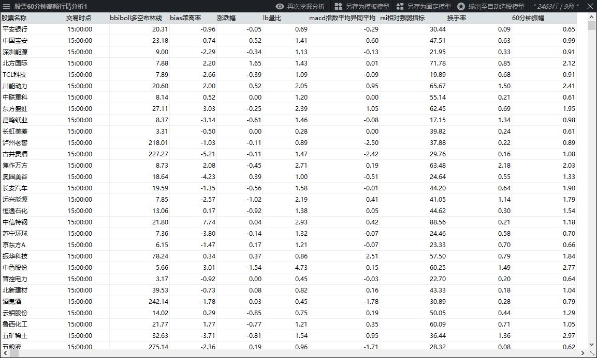

    

> *分析结果可无限次再分析：由该界面生成的统计结果均从服务器中获取数据，点击**多维分析**，还可进行再次无限次分析；*

#### ** 模板模型 **

## 模板模型

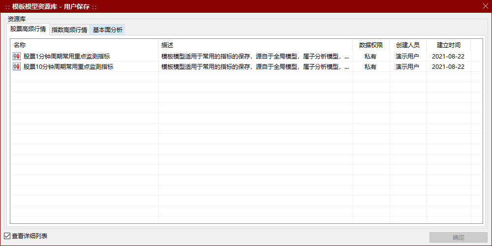

1. 模型来源：模板模型中的主题对象、主题指标均来自于全局模型，一张全局模型可生成无数张模板模型；
2. 模板模型原则上源自于全局模型，但也可由模板模型、固定模型衍生；
3. 模板模型可定义为私有和公有，均有用户决定，用户保存后的模板模型对象在该用户的模板模型资源库中；
4. 模板模型对象用户也可自行维护，在管理个人资源中维护管理；
5. 为了界面的友好性，模板统计资源库、固定统计资源库与全局统计资源库一致属于同一个界面，但内容已做了区分；

> *站在系统管理员和市场分析人员的角度：模板模型有利于控制维度的可见权限，系统管理员可在后台自行生成一批模板模型对象，设为公有，分门别类授权，比如针对一些用户不设置全局模型权限，只开放模板模型权限，则有效的控制了维度数据的可视权限。*

#### ** 固定模型 **

## 固定模型

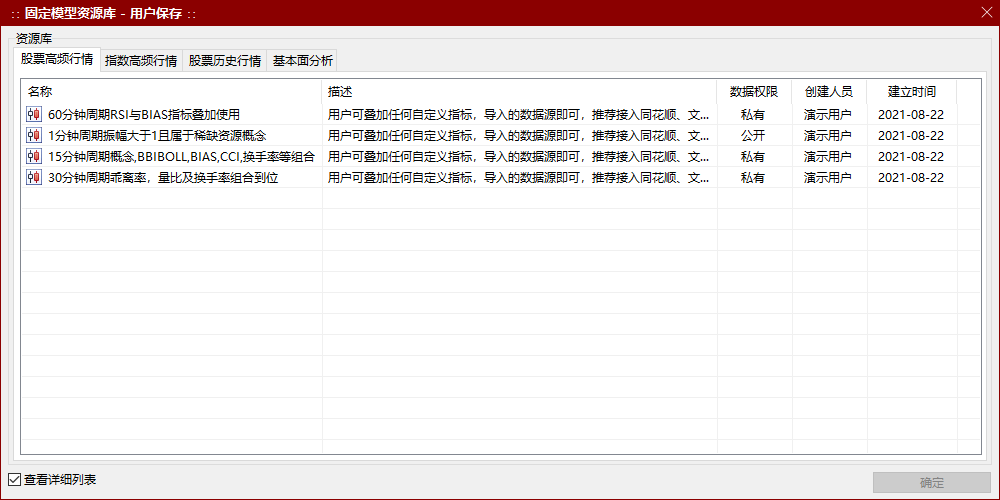

1. **模型来源**：由用户点击保存为固定模型后生成，衍生于全局统计，属全局统计的子类；一张全局统计可生成无数张固定模型；
2. **无法变更条件**：主题对象、主题指标、固定代码条件以及自定义条件等逻辑均已固化，界面无法更改；
3. **应用场景**：满足于高频度、多用户的日常使用统计分析需要，只需改变统计时间即可；
4. **权限**：固定模型可定义为私有和公有，均有用户决定，用户保存后的固定模型在该用户的模板统计资源库中；

> *站在系统管理员和基金经理的角度：固定统计有利于设计固定模型，系统管理员和统计专家可在后台自行生成一批固定模型对象，设为公有，分门别类授权，极大的降低了具体投研分析人员使用系统的门槛。*

#### ** 数据挖掘 **

## 多维分析

1. **多维分析**：对前窗口的统计数据进行进一步多层次分析，以满足多层次、个性化统计分析的要求；适用于全局统计、模板统计、固定统计对象；
2. 多维分析重用了**选择综合分析要素**界面，简单方便；
3. **自动导入前一次分析方法**：任何分析结果都保存在缓存当中，前一次勾选主题对象、主题指标、筛选条件、自定义条件及分组汇总自动导入；
4. **多维分析的数据来源**：从服务器重新计算最新统计结果；

>*灵活使用多维分析：多维分析是数据挖掘重要的分析手段，使用方式千变万化，实际工作中不断使用和探索，方显其威力。*

## 分类汇总

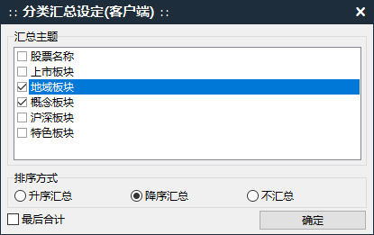

1. **定义**：对当前统计结果的主题对象进行多层次分类汇总；
2. **汇总主题**：默认带入统计结果的主题对象，主题指标由主题对象决定，默认为合计；
3. **排序方式**：升序汇总、降序汇总、不汇总；
4. **主题排序可叠加汇总**：比如地域板块按照升序汇总、概念板块按照降序汇总，用户可根据实际需求确定汇总组合；

> *速度极快：属于客户端内存操作，不占用服务器资源；如需向服务器发出请求，则点击**多维分析**；*

## 数据排序

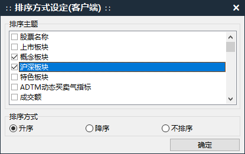

1. **定义**：对当前统计结果的主题指标进行排序统计；
2. **排序主题**：默认带入统计结果的主题指标，主题对象由主题指标排序结果决定，默认为合计；
3. **排序方式**：升序、降序、不排序；主题指标排序方式不可叠加汇总；

>* **速度极快**：属于客户端内存操作，不占用服务器资源；如需向服务器发出请求，则点击**多维分析**；*

## 数据过滤

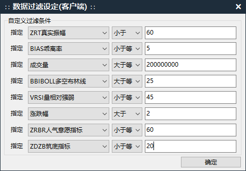

1. **定义**：对当前统计结果进行多层次过滤统计；
2. **参与主题**：所有统计结果显示的维度均可参与过滤；
3. **取消单个条件**：清除具体数值即可；

> *速度极快：属于客户端内存操作，不占用服务器资源；如需向服务器发出请求，则点击**多维分析**；*

<!-- tabs:end -->
