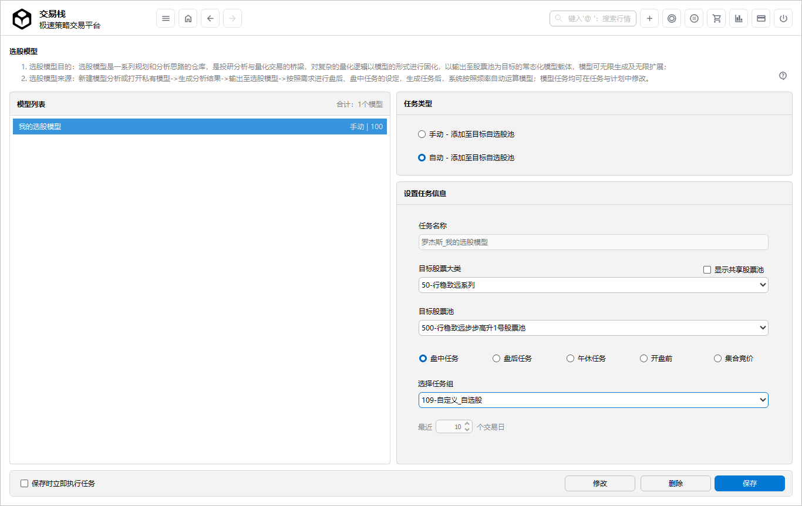

# 选股模型

>*选股模型：选股模型是投研分析与量化交易的桥梁；是对自身产品的逻辑规则以模型形式固化，以输出股票等交易品种为最终目的常态化、随需而变的模型载体；*

- 选股模型由投研分析生成，系统自动生成代码；
- 选股模型也可通过设置任务编写SQL语句生成；
- 支持手动和自动导入至目标自选股池子；
- 支持盘后任务、盘中任务组，并设置间隔频率。

## 模型管理

1. **选股模型来源**：选股模型来源于投研分析板块中->生成分析模型->输出至选股模型；一般以固定模型居多； 
2. **选股模型作用**：可以把固定化的条件常态化的进行股票池的筛选；多个选股模型叠加使用，也可提升股票池的符合个人偏好；
3. **选股模型的内容**：当手动导入自选股池子时，包含当时分析后的一批股票和逻辑；当自动任务导入自选股池子，包含最新符合条件的股票池和逻辑；
4. **选择数据类型**：包括交易类数据、基金类数据、个股持仓数据、基本面数据、股票高频数据、指数高频数据以及实时数据等分类；
5. **选股模型信息**：可对模型名称、模型备注进行修改。

>*选股模型是一系列规划和分析思路的仓库；来自于投研分析模块的设计结果，随时可以为量化交易替换和追加股票池所用；可进行实盘环境和仿真环境的校验。*

##  设置定时任务

1. **任务属性**：默认状态下，任务属性为**手动 - 添加至目标自选股池**，如勾选**自动 - 添加至目标自选股池**，则系统在后台生成一项任务，定时执行；
2. **任务名称**：默认为选股模型名称，可修改；
3. **目标股票池**：选择目标股票分组大类和小类；
4. **任务组**：包括盘中任务、盘后任务；
5. **任务循环间隔**：盘中任务以秒为单位，盘后任务以最近天数为单位；
6. **任务的维护**：生成任务后，在**任务与计划设置**界面可以进行维护。

>*盘后任务、盘中任务生成模型后，均可在任务计划中修改规则。*
