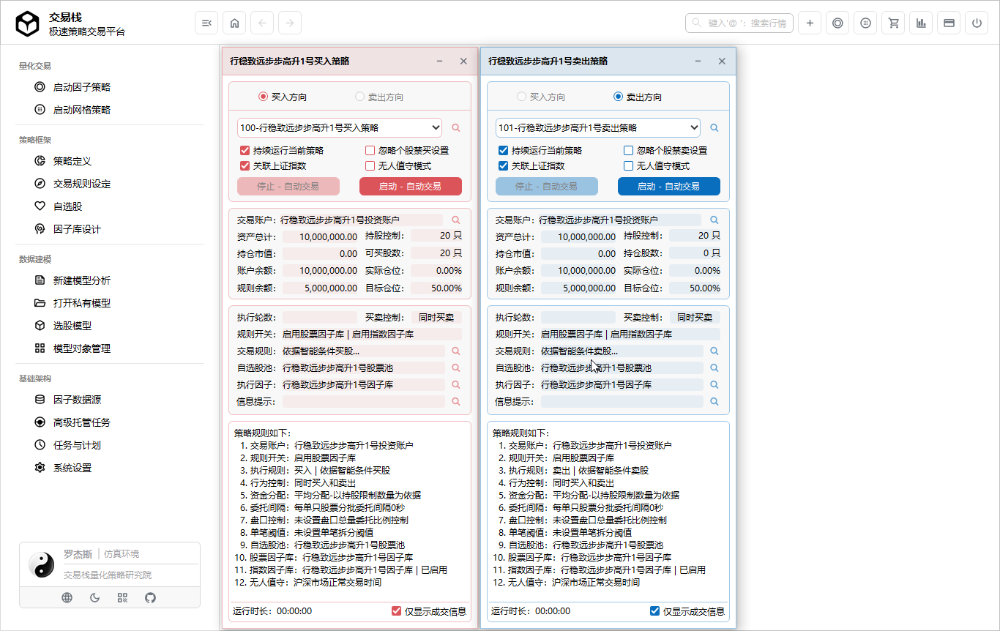

<p align="center">

</p>

# 交易栈 - 让量化交易触手可及

交易栈（Tradestack）是一款原生、易用且功能强大的量化交易平台，可快速部署您的策略并投入到实战。

- **简约不简单，不变应万变**

  > 化繁为简，功能强大，上手很轻松，无需编程。通过模块化、标准化的设计，像搭积木一样拼接可复用的操盘模块，让量化模型更快进入实战。

- **投研直达交易的完整闭环**

  > 从交易账户管理、交易规则设定、股票池与因子库设计，到数据建模、策略组装和策略执行，高度集成，覆盖量化交易全流程。

- **全面支撑的企业级量化架构**
  > 既适用于个人与团队，也能作为企业级量化交易的基础架构；高性能核心、多数据库支持、模块化扩展与高可靠性托管，全面满足企业级需求。 
<p align="Left">
    
 </p>

## 🚀 快速部署

- **数据库准备**

1. 确认您已安装并能正常使用 **MySQL**。
2. 准备一个 MySQL 账户（建议为专门账户，避免使用 root）。  
3. 新建数据库，执行以下命令：
```bash
# 使用 root 或已有账户登录 MySQL
mysql -u root -p

# 创建数据库
CREATE DATABASE tradestack DEFAULT CHARACTER SET utf8mb4 COLLATE utf8mb4_general_ci;

# 创建专用用户（替换 your_password 为自定义密码）
CREATE USER 'tradeuser'@'%' IDENTIFIED BY 'your_password';

# 授权用户访问新数据库
GRANT ALL PRIVILEGES ON tradestack.* TO 'tradeuser'@'%';

# 刷新权限
FLUSH PRIVILEGES;
```

- **服务器端部署**

1. 双击运行安装程序，按照提示点击 [下一步] 完成安装，然后打开服务器端程序。  
2. 输入数据库配置信息，点击 [启动服务] 完成通讯连接。  
3. 在程序界面，点击 [v] -> [安装 - 运行环境]，系统将自动初始化环境，请耐心等待完成。  
4. 当界面出现提示信息时，即表示服务器端安装成功。  
5. 部署完成后，请保持 **Tradestack Server** 持续运行，客户端将通过它进行通信并执行所有操作。

```bash
2025-09-26 08:04:07：√ 完成处理基本板块及概念块板框架架
2025-09-26 08:04:07：√ 运行环境预处理、初始化成功，系统准备就绪...
--------------------------------------------------------------------------------
2025-09-26 08:04:07：实盘与仿真环境 - 交易数据服务 - 已连接
2025-09-26 08:04:07：实盘与仿真环境 - 全局任务计划 - 启动中
```

- **客户端部署**

1. 双击运行安装程序，按照提示一直点击 [下一步]，直至安装完成。  
2. 安装完成后，打开客户端程序。  
3. 使用默认用户名和密码，即可进入软件主界面。

- **客户端连接**
1. 在服务器端，打开 [菜单] -> [生成客户端链接文件]。  
2. 输入 Tradestack Server 所在服务器的 IP 地址，点击 [生成链接配置文件]。  
3. 将生成的 `Connection.xml` 拷贝至客户端安装目录的根目录。  
4. 重新启动客户端，即可正常登录。
   
## 📋 主要功能
**量化交易**
- [ 启动因子策略 ](./Start_Factor_Strategy.md)
- [ 启动网格策略 ](./Start_Grid_Strategy.md)

**策略框架**
- [ 策略定义 ](./Strategy_Definition.md)
- [ 交易规则设定 ](./Trading_Rules_Setup.md)
- [ 自选股 ](./Custom_Stocks.md)
- [ 因子库设计 ](./Factor_Library_Design.md)

**数据建模**
- [ 新建模型分析 ](./New_Model_Analysis.md)
- [ 打开私有模型 ](./Open_Private_Model.md)
- [ 选股模型 ](./Stock_Selection_Model.md)
- [ 模型对象管理 ](./Model_Object_Management.md)

**基础架构**
- [ 因子数据源 ](./Factor_Data_Source.md)
- [ 高级托管任务 ](./Advanced_Managed_Tasks.md)
- [ 任务与计划 ](./Tasks_And_Plans.md)
- [ 系统管理 ](./System_Management.md)

## 💡 常见问题
- 需要学习编程语言吗？
  > 无需学习编程语言即可使用，高阶用户可直接使用 SQL 编写或调整脚本；同时，系统可自动生成绝大多数 SQL 脚本，操作简便。

- 是否支持本地化部署？需要安装第三方运行包吗？
  > 完全支持本地化与私有化部署，用户可在自己的服务器、局域网或个人电脑上独立运行，无需依赖第三方云端。不需要安装第三方运行包，系统自带所有核心运行环境和依赖，无需用户额外安装第三方运行包即可正常使用。

- 是否支持实时行情？是否支持实时行情快照保存？
  > 支持接入交易所规范的 Level2 行情，同时兼容第三方行情数据源。系统支持 1/3/5/10/15/30/60分钟及日线周期的行情快照保存；同时，用户可自定义行情周期，实现个性化数据存储需求。

- 实盘交易接口如何实现？
  > 两种方式：提供数据库级别交易接口的数据交换；提供文件级别的数据交换；目前已对主流的券商的委托下单柜台进行了对接和适配。

- 系统支持第三方策略数据库吗？
  > 支持外部策略库接入。用户可将自有策略数据库或第三方策略库导入系统，无需编写代码，即可在系统内调用、组合和执行策略，实现灵活扩展和策略复用。


## 🏷️ 关于交易栈 

交易栈（Tradestack）是一款独立开发者打造的量化交易平台。
欢迎有兴趣的伙伴一起优化和完善交易栈，让交易栈体验更好。

- 微信联系:  
  
- 文档中心: [docs.tradestack.org](http://www.tradestack.org:3000/#/README)
