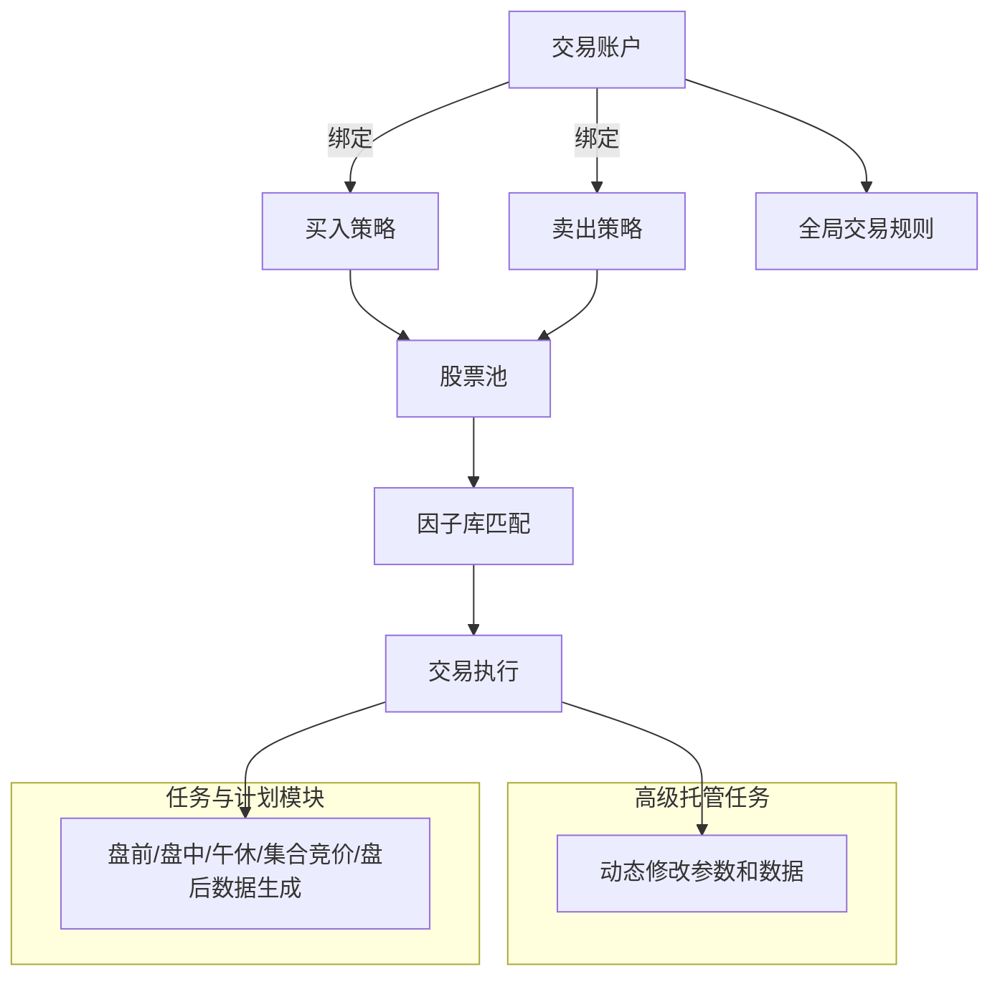

## Tradestack - 让量化交易触手可及

Tradestack（交易栈）一款原生、易用且功能强大的量化交易平台，可快速部署您的策略并投入到实战。

想立即上手？ 马上阅读 [5分钟快速入门教程 ⏱️](./QuickStart.md)!

- **简约不简单，不变应万变**

  > 将复杂功能化繁为简，既功能强大又易上手，无需编程。通过组件化、标准化的设计，像搭积木一样构建可复用的操盘模块，加速量化模型投入实战。  
  > 您可以通过 [策略定义](./StrategyDefinition.md) 自由组合策略，也可以借助 [策略助手](./StrategyDefinition.md) 生成专业的买卖方向策略，即刻投入实盘或仿真环境交易。

- **投研直达交易的完整闭环**

  > 打造从数据建模、策略定义到交易执行的完整闭环。借助 [模型对象管理](./StrategyDefinition.md) 和 [模型分析](./StrategyDefinition.md) 工具进行数据建模，通过 [交易规则](./StrategyDefinition.md) 对账户进行全局规则和风险控制；  
  > 利用 [因子库设计](./StrategyDefinition.md) 创建指数或股票的买入和卖出因子库；  
  > 通过 [自选股](./StrategyDefinition.md) 和 [选股模型](./StrategyDefinition.md) 动态生成股票池，最后通过 [启动因子策略](./StrategyDefinition.md) 执行自动交易。

- **企业级量化架构**

  > 策略引擎、规则引擎、交易引擎与任务引擎协同运行，采用先进算法，降低技术门槛和效率瓶颈。  
  > 原生代码加微服务设计，配合全内存管理，实现微秒级响应和高吞吐量策略执行。  
  > 即插即用，方便接入券商柜台系统，支持多用户、多策略，7×24 小时全天候无人值守运行。

## 系统设计逻辑概览

1. **交易账户**
   - 对应两个策略：
     - 买入方向策略
     - 卖出方向策略
   - 全局交易规则：
     - 目标仓位、交易行为、资金分配
     - 加仓、减仓、拆单等

2. **股票池**
   - 买卖策略共享同一股票池
   - 来源：
     - 选股模型
       - 由模型对象分析生成
   - 个股可精细控制：
     - 资金权重、优先级
     - 锁仓、禁买/禁卖

3. **因子库**
   - 买入方向 → 买入因子库
   - 卖出方向 → 卖出因子库
   - 类型：
     - 股票类因子
     - 指数类因子
   - 策略启动后实时匹配股票池，符合条件即交易

4. **策略执行流程**
   - 系统读取交易账户规则 → 获取股票池 → 因子库匹配股票
   - 高级托管任务动态调整模块参数，策略随需而变
   - 任务与计划模块负责盘前、盘中、盘后等所有元素的数据生成与逻辑执行

---

## 系统实现模块映射（因子策略示例）

1. **创建交易账户**
   - 模块：[交易账户管理]

2. **设置交易规则**
   - 模块：[交易规则设定]
   - 控制目标仓位、交易行为、资金分配等

3. **生成股票池**
   - 模块：[自选股]
   - 股票来源：
     - 高级托管任务共享池
     - [新建模型分析] 或 [打开模型分析]
   - 支持个性化股票控制

4. **定义因子库**
   - 模块：[因子库设计]
   - 定义买卖方向指数类/股票类因子

5. **组装策略**
   - 模块：[策略定义]
   - 组合交易账户、股票池、因子库形成完整策略

6. **启动策略**
   - 模块：[启动因子策略]
   - 系统持续匹配股票池，条件满足立即交易

7. **一键生成**
   - 模块：[策略定义助手]
   - 自动生成完整因子策略流程

---

## 系统流程图 (Mermaid 示例)

## 社区

## 捐赠

## 联系我们 

Tradestack（交易栈）作为一款独立开发者的软件，**社区版永久免费开放使用**。欢迎您通过以下方式支持或参与：  
- **提交反馈**：在使用过程中发现问题或有改进建议，欢迎提出；  
- **贡献代码/文档**：任何 PR 或文档优化，都是对项目的巨大帮助；  
- **交流探讨**：一起探索更高效、更稳健的量化交易实践。  

您的每一份参与，都会让 Tradestack（交易栈） 变得更好。

- 微信联系：
  
- 文档中心：[docs.tradestack.org](http://www.tradestack.org:3000/#/README)

## License

Docusaurus is [MIT licensed](./LICENSE).
