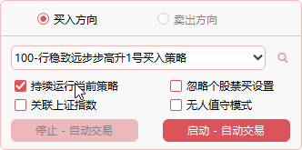

## 🚀 启动因子策略

> 以因子为核心的策略执行机制，综合交易规则、交易逻辑、买卖方向因子库、指数关联及股票池等动态要素，形成完整的策略执行体系。

- **全自动量化交易载体**：任何投资决策理念及资金规划均可在因子策略中执行。

- **仿真与实盘合一**：将正式交易与仿真交易统一，仿真环境与实盘保持一致，可实时验证策略可行性，从而优化策略的盈利能力。

- **在线更新**：启动实例后，策略可像“高速公路换轮胎”般不中断运行，即可在线更新股票池、资金仓位、因子参数及指数联动等配置。

- **远程操作**：通过手机终端即可完成策略的设置与更新，随时随地掌控策略运行。

   
   

## 🛠️ 具体功能

- **策略的买卖方向与选择**：
 

    
 

- **隔离的买卖实例**：因子策略将买入与卖出分为独立实例。比如勾选“买入方向”后，下拉框仅显示对应的买入策略。

- **多实例启动**：如需同时运行多个策略，可开启多个因子策略窗口。每个实例由独立线程处理，互不干扰。

- **策略列表**：下拉列表框显示所属人员可执行的策略。策略列表由 [ 策略定义 ](./Strategy_Definition.md) 中定义。

- **持续运行当前策略**：策略启动后将持续运行，实时监控行情与策略条件是否匹配，一旦匹配即自动下单，直至人工停止。  

- **忽略个股禁买/卖设置**：
  - 默认行为：当股票池中某只股票被设置为禁买时，即使策略条件满足，该股票也不会被下单。
  - 勾选：如果勾选此选项，则策略将忽略个股的禁买规则，允许下单。

- **关联指数**：
  - 勾选“关联指数”后，策略将在满足指数条件的前提下，再对股票因子库进行匹配运算。  指数条件包括指数因子库和指数联动
  - [ 指数因子库 ](./Strategy_Definition.md)：如果在策略定义中设置了当前策略的指数因子库，则策略执行因子库设计中的指数因子。  
  - [ Index_Linkage ](./Strategy_Definition.md)：如果在策略定义中设置了当前策略的指数联动，  则策略执行指数联动中的设置。
  - 除标准指数外，可自定义任意指数。
  > 该选项可与无人值守模式联合使用，最大程度解放操盘手。  

- **无人值守模式**：勾选此选项后，系统将在 10 秒后自动启动策略执行，并持续运行，直至人工干预。 如何设置详见 [ 交易规则设定 ](./Trading_Rules_Setup.md)

- **自动写入执行日志**：策略停止运算时，系统会将当前交易日的所有交易行为写入文本文件，存放于 `Logs` 目录。无人值守模式同样适用。  

- **启动 - 自动交易**：策略将根据策略定义的所有规则进行运算，满足条件后执行委托操作，并获取券商返回的交易状态。  

- **停止 - 自动交易**：策略将立即停止运算和交易。

