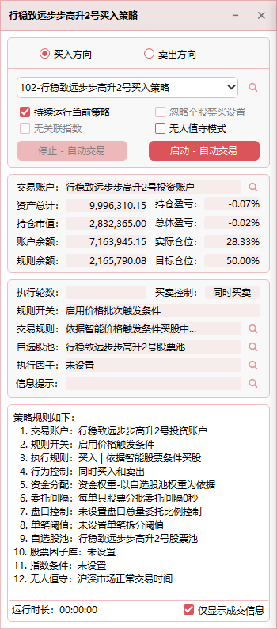
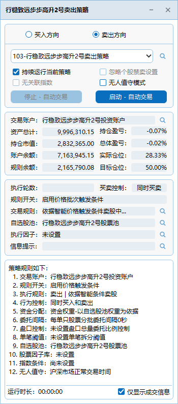
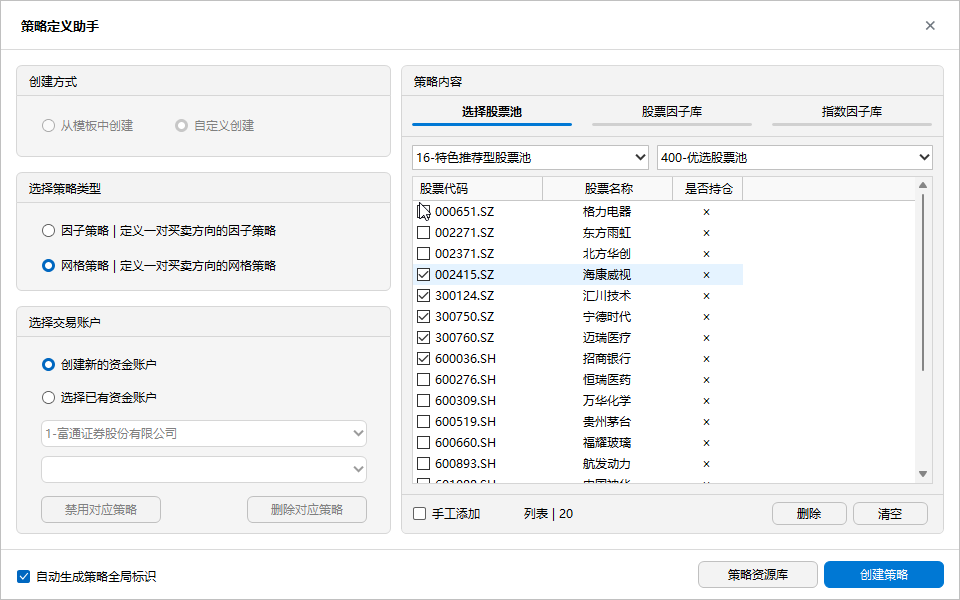
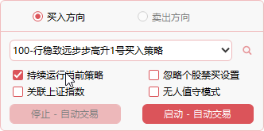
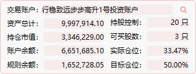
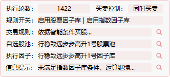
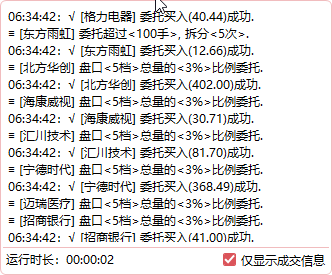

## 🚀 启动网格策略

- **定义** ：以价格为导向的策略执行机制，涵盖基金规则、交易逻辑、买卖方向因子库、买卖价格批次、指数关联以及股票池等动态组合而成的综合策略执行体。
- **与因子策略的区别**：
  - 因子策略：策略的运算和交易决策主要基于**因子库**，通过不同因子组合、规则和指数关联来执行买卖操作，重点在“因子信号驱动”。  
  - 网格策略：策略的运算和交易决策主要以**价格信息**为核心，包括买卖价格批次、基金规则、交易逻辑、指数关联以及股票池等，重点在“价格信号驱动”。    
- **增加价格因素**  ：可以更精确地指定股票价格，而因子导向策略则是通过百分比指定。
- **增加批次买卖触发条件**  
  - 可分批指定委托买入的价格和权重资金。  
  - 可分批指定卖出的价格和股数。  
- **网格交易模式** ：提供更灵活的 **T+0 交易控制**。
- **支持忽略因子条件** ：交易门槛更低，无需编写专门的因子，仅通过设定批次价格委托区间即可交易。
- **价格因子和指标因子共存** ：可选指标因子，在同时满足指标因子和价格因子的情况下进行交易，实现灵活组合。
  

     
     

## 🛠️ 网格策略的建立  
1. 点击工具栏的  ，打开 [ 策略定义助手 ](./Strategy_Definition_Helper.md) ；
2. 在左边界面中，依次点击：[ 用户自定义 ] -> [ 网格策略 | 定义一对买卖方向的网格策略 ] -> [ 创建新的资金账户 ] ；
3. 在右边界面中，在 [ 选择股票池 ]中选择股票池，这里我们选择 [ 16-特色推荐型股票池 ] -> [ 400-优选股票池] ；
4. 如需删除股票，勾选所需删除，点击 [ 删除 ] 股票，如无需删除，则点击 [ 创建策略 ]
   

    
 

5. 恭喜，网格策略创建成功！系统跳到 [ 策略定义 ](./Strategy_Definition.md) 界面，可见刚刚定义的网格策略。

## 📌 详细介绍

1. 策略的买卖方向与选择
   

    
 

 
- **隔离的买卖实例**：因子策略将买入与卖出分为独立实例。比如勾选“买入方向”后，下拉框仅显示对应的买入策略。
- **多实例启动**：如需同时运行多个策略，可开启多个因子策略窗口。每个实例由独立线程处理，互不干扰。
- **策略列表**：下拉列表框显示所属人员可执行的策略。策略列表由 [ 策略定义 ](./Strategy_Definition.md) 中定义。
- **持续运行当前策略**：策略启动后将持续运行，实时监控行情与策略条件是否匹配，一旦匹配即自动下单，直至人工停止。  
- **忽略个股禁买/卖设置**：
  - 默认行为：当股票池中某只股票被设置为禁买时，即使策略条件满足，该股票也不会被下单。
  - 勾选：如果勾选此选项，则策略将忽略个股的禁买规则，允许下单。
- **关联指数**：
  - 勾选“关联指数”后，策略将在满足指数条件的前提下，再对股票因子库进行匹配运算。  指数条件包括指数因子库和指数联动
  - [ 指数因子库 ](./Factor_Library_Design.md)：如果在策略定义中设置了当前策略的指数因子库，则策略执行因子库设计中的指数因子。  
  - [ 指数联动 ](./Index_Linkage.md)：如果在策略定义中设置了当前策略的指数联动，  则策略执行指数联动中的设置。
  - 除标准指数外，可自定义任意指数。
   > 该选项可与无人值守模式联合使用，最大程度解放操盘手。  
- **无人值守模式**：勾选此选项后，系统将在 10 秒后自动启动策略执行，并持续运行，直至人工干预。 如何设置详见 [ 交易规则设定 ](./Trading_Rules_Setup.md)
- **自动写入执行日志**：策略停止运算时，系统会将当前交易日的所有交易行为写入文本文件，存放于 `Logs` 目录。无人值守模式同样适用。  
- **启动 - 自动交易**：策略将根据策略定义的所有规则进行运算，满足条件后执行委托操作，并获取券商返回的交易状态。  
- **停止 - 自动交易**：策略将立即停止运算和交易。

2. 资金及仓位情况
    

    
 

 
- **账户名称**：当前交易的账户名称，对应券商开户账号；交易账户在交易规则中维护；账户名称前的编号为唯一标识；点击   可直接查看交易账户的持仓情况。
- **总资产**：当前账户的总资产，系统根据实时行情动态生成。
- **持仓市值**：当前账户所持有股票的总市值，系统根据实时行情动态生成。
- **账户余额**：当前账户的可用余额，不包含在途冻结额度。
- **规则余额**：不同于账户余额，规则余额为目标仓位系数下的可用余额，会随总资产与持仓市值动态变化。  
  - 若规则余额为正，说明尚未超出设定的目标仓位；  
  - 若规则余额为负，说明已超出设定的目标仓位。  
  - 规则余额已包含当前仓位下的预估手续费。
- **持仓盈亏**：  
  公式 = (当前持仓股票总市值 - 当前持仓股票总成本) ÷ 当前持仓股票总成本 × 100%。
- **总体盈亏**：  
  公式 = ((当前持仓股票总市值 + 账户余额) - (当前持仓股票总成本 + 账户余额)) ÷ (当前持仓股票总成本 + 账户余额) × 100%。
- **实际仓位**：当前交易账户的实际仓位，随行情动态变化。
- **目标仓位**：当前交易账户预设的目标仓位。
> 当策略处于 **运行期间**，系统将动态显示当前交易账户的总资产、市值、账户余额及动态余额情况，并展示根据交易规则设定的目标仓位与实际仓位等信息。

3. 执行状态
    

    
 
  

7. 执行日志

  
**2. 资金及仓位情况**

**3. 执行状态**

 
- **执行轮数**：表示当前策略运算的轮次，一轮包括规则的运算和交易的完成。  
- **规则开关**：用于控制交易行为，在交易规则中设置，参数可即时生效，无需停止运算。  
- **执行规则**：展示当前策略启用的交易规则信息。  
- **自选股池**：策略启用的股票池，点击  即可直接定位到该股票池。  
- **执行因子**：策略启用的因子库，点击  即可直接定位到该因子库。  
- **信息提示**：展示策略执行过程中的重要提示信息，包括当前基金所处的交易状态；系统目前已定义了几十种交易状态，以满足不同交易场景的需求。  
 
**4. 执行日志**
 

    
 

 
- **日志**：在策略执行过程中，系统会显示所有策略的执行规则、交易状态，以及交易所反馈的异常信息；支持导出保存。
- **运行时长**：记录并显示当前策略自启动运算以来的运行时长。
- **仅显示成交信息**：勾选后，系统仅展示实际成交信息，其他信息将被隐藏。
- **日志存储**：每次运算结束后，日志文件将自动存储在 `Logs` 目录下，便于后续查看与分析。

