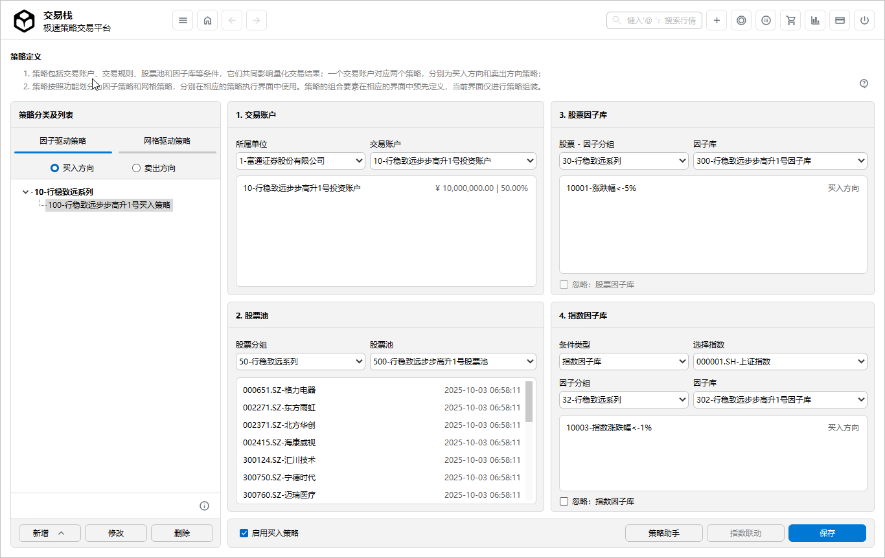

# 策略定义

- **定义**：以交易账户、股票因子库、指数因子以及股票池为主体的策略集合，定义完毕后即可在策略执行界面中使用。
- **策略类型**：系统支持两种策略类型，分别为 **因子策略** 和 **网格策略**，并在各自独立的界面中使用。  
- **策略方向**：一个交易账户通常对应两项策略，分别为 **买入方向策略** 与 **卖出方向策略**。  
- **策略组合**：策略组合灵活多变，可为单一基金定义多组策略，并可在不同策略间自由切换。
- **条件定义与复用**：策略的各类组合条件均可在对应模块中预先定义，实现一次配置、多次复用。  
  - 因子条件可在 [因子库设计](./Factor_Library_Design.md) 中定义。  
  - 自选股可在 [自选股](./Custom_Stocks.md) 中配置。 
- **合理性校验**：系统在策略定义过程中会自动执行合理性校验，以提升策略的有效性并防范潜在风险。
 

    
 

## 策略分组与策略

1. **添加策略分组**：点击 [ 新增 ] -> [ 新增策略分组 ] ， 策略分组的命名最好是XX系列，方便管理，也和因子库、自选股池子的XX系列对应。
   

    
 

   
2. 输入分组名称，点击 [ 确定 ]；
3. **添加策略**：输入**策略名称**；然后点击  [ 确定 ] ；这样一项策略的名称定义好，接下来定义策略所包含的内容。
   

    
 

   
## 指定股票、因子和资金账户

1. **交易账户**：选择券商和交易账户；券商在 [ 系统管理 ] -> [ 权限设置 ] -> [ 券商管理 ] 中设置，交易账户在 [交易账户管理](./Trading_Rules_Setup.md) 中设定；
   

    
 

2. **指定自选股池子**：选中策略，在**选择自选股**界面中，选择股票大类和小类；股票大类和小类在 [自选股](./Custom_Stocks.md) 中配置； 
   

    
 

3. **股票因子库**：在**选择股票因子库**界面中，选择因子分组和因子库；因子分组和因子库在 [因子库设计](./Factor_Library_Design.md) 中定义。  
   

    
 

 
4. **指数因子库**：在**选择股票因子库**界面中，选择因子分组和因子库；因子分组和因子库在 [因子库设计](./Factor_Library_Design.md) 中定义。
   

    
 

  - 若未勾选“忽略指数因子库”，则可选择两种指数关联方式：  
    - 指数联动
    - 指数因子库
  - 指数联动：主要用于控制交易账户仓位和交易行为，可在 [ 指数联动 ](./Index_Linkage.md) 界面中设置。  
  - 指数因子库：主要用于控制规则条件，可在 [ 因子库设计 ](./Factor_Library_Design.md) 界面中配置。  
  - 下拉选择关联指数后，可在 [ 指数联动 ](./Index_Linkage.md) 界面中勾选当前策略对应的交易账户。
   
5. **保存策略**：当各项内容选择完毕后，点击 [ 保存 ] 。

## 重点说明
1. 当你针对某一个交易账户定义了一项买入策略后，请务必同时定义一项卖出策略。  
2. 策略名称会自动在末尾添加“买入策略”或“卖出策略”字样，以便区分。  
3. 同一交易账户下的策略，其 [ 股票池 ] 需保持一致。  
4. [ 因子策略 ] -> [ 股票因子库 ] 为必选项；[ 网格策略 ] -> [ 股票因子库 ] 为可选项；而 [ 因子策略 ] 与 [ 网格策略 ] -> [ 指数因子库 ] 均为可选项。
5. 您可以使用 [ 策略定义助手 ](./Strategy_Definition_Helper.md) 快速创建一对策略，无需在此界面逐项设置。  

