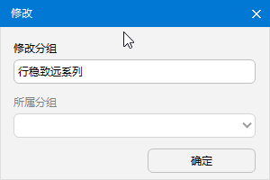
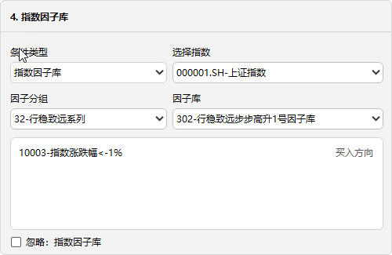

# 策略定义

- **定义**：以交易账户、股票因子库、指数因子以及股票池为主体的策略集合，定义完毕后即可在策略执行界面中使用。
- **策略类型**：系统支持两种策略类型，分别为 **因子策略** 和 **网格策略**，并在各自独立的界面中使用。  
- **策略方向**：一个交易账户通常对应两项策略，分别为 **买入方向策略** 与 **卖出方向策略**。  
- **策略组合**：策略组合灵活多变，可为单一基金定义多组策略，并可在不同策略间自由切换。
- **条件定义与复用**：策略的各类组合条件均可在对应模块中预先定义，实现一次配置、多次复用。  
  - 例如：因子条件可在 [因子库设计](./Factor_Library_Design.md) 中定义。  
  - 自选股可在 [自选股](./Custom_Stocks.md) 中配置。 
- **合理性校验**：系统在策略定义过程中会自动执行合理性校验，以提升策略的有效性并防范潜在风险。
  
  

## 策略分组与策略

1. **添加策略分组**：点击 [ 新增 ] -> [ 新增策略分组 ] -> [ 确定 ] ， 策略分组的命名最好是XX系列，方便管理，也和因子库、自选股池子的XX系列对应。
	
	
2. 输入分组名称，点击**确定**；这是界面树形结构根目录出现新增的致远量化系列分组；选中该分组，点击**添加策略**； 
	
	
3. **添加策略**：系统默认选择选中分组，输入**策略名称**；然后点击**确定**；这样一项策略的名称定义好，接下来定义策略所包含的内容。

>*说明：当需要删除策略分组时，如当前分组包含策略，则无法删除；策略名称后缀自动加上策略两字。*

## 指定股票、因子和资金账户

1. **指定自选股池子**：选中策略，在**选择自选股**界面中，选择股票大类和小类；股票大类和小类在**自选股**界面中设定； 
	
2. **指定基金**：在**选择基金**界面中，选择券商和基金；券商和基金在**交易账户**界面中设定； 
	
3. **指定股票因子库**：在**选择股票因子库**界面中，选择因子分组和因子库；因子分组和因子库在**因子设计**界面中设定； 
	
4. **指定指数因子库**：在**选择股票因子库**界面中，选择因子分组和因子库；因子分组和因子库在**因子设计**界面中设定； 
	
	- 未勾选忽略指数因子库，则可选两种指数关联方式，一种是指数联动，一种是指数因子库；
	- 指数联动主要控制基金仓位和交易行为，在**指数联动**界面设置；
	- 指数因子库主要控制规则条件，在**因子设计**界面中设置；
	- 下拉指定关联指数，关联指数在**指数联动**界面中勾选当前策略的基金；

5. **保存策略**：当各项内容选择完毕后，点击保存策略。

>*说明：因子导向策略股票因子库是必选项，价格导向策略股票因子库是可选项；因子导向策略与价格导向策略指数因子库均是可选项。*

## 启用策略与策略检查
1. **启用策略**：当策略保存后，点击**启用策略**，然后再点击**保存策略**，将会检查策略的有效性，通过则启用，如报错，将无法保存策略；

2. **策略检查**：如策略不能通过，原因主要有以下几种：

   - 当前基金被其他策略以同样买卖方向的策略在使用；通过点击**策略检查**，查看当前基金被哪项策略启用，取消勾选启用策略，解绑当前基金；
   - 当前股票池被其他策略以同样买卖方向的策略在使用；通过点击**策略检查**，查看当前股票池被哪项策略启用，取消勾选启用策略，解绑当前股票池；
   - 当前的股票池为空；当前的股票因子库为空；在**自选股**界面中检查；
   - 勾选了指数因子库后，当前的指数因子库为空；在**因子设计**界面中检查。

## 执行权限与解锁策略
1. **执行权限**：策略定义好之后，默认权限为空，点击**执行权限**指定可执行策略的用户。
	
2. **锁定规则**：为确保策略的有效性，一项策略同时只能运行一次；当一项策略正在被执行，该策略将被锁定，因子导向策略和价格导向策略界面中将无法显示该策略；
3. **策略状态**：选择一项策略，界面中会实时显示策略状态；
    
4. **解锁策略**：当确定策略未被执行，但又显示策略正在被使用，则可以点击解锁策略。

>*说明：仿真环境为方便策略测试，不锁定策略。*
