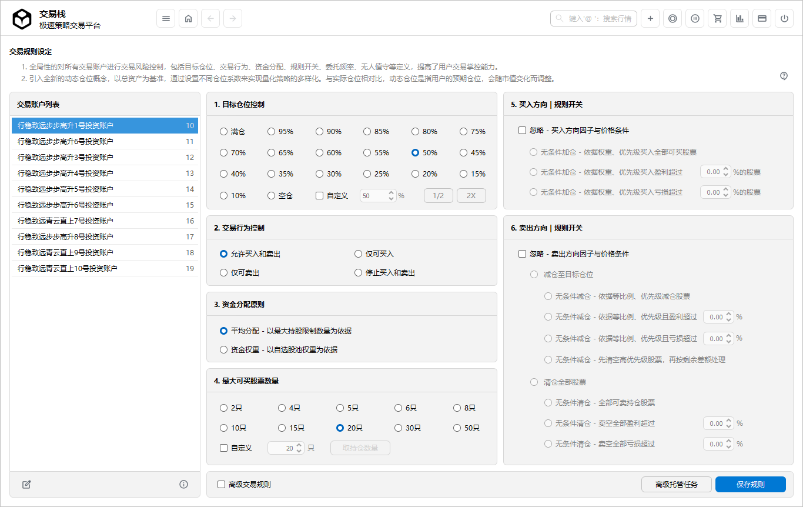
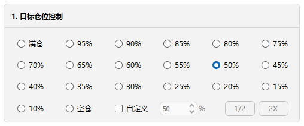
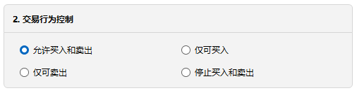
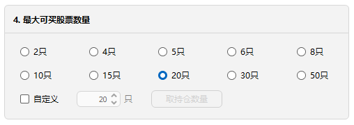
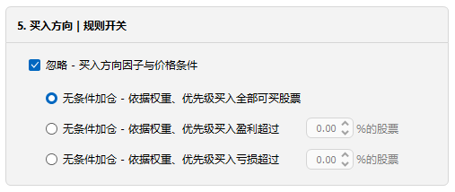
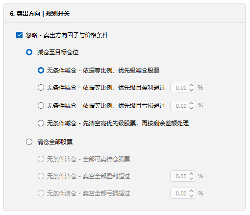
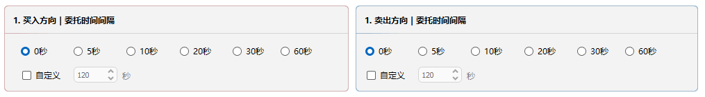
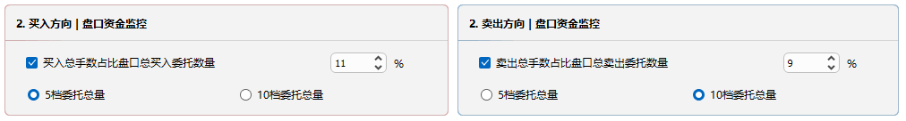
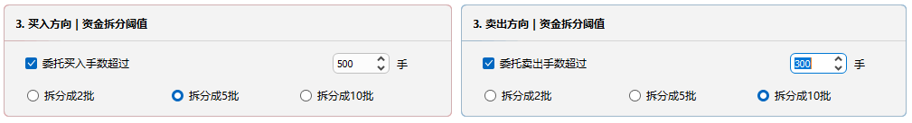
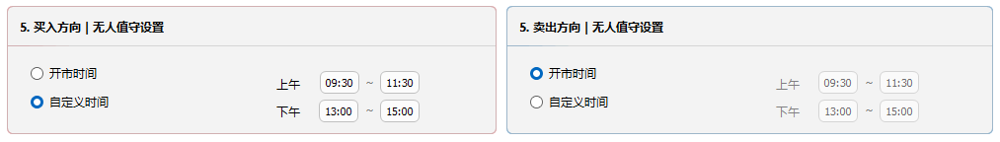

# 交易规则

>*交易规则：对所有管理的交易账户进行全局的交易和风险控制，包括对资金账户的目标仓位、交易行为、交易方式、资金分配方式、规则开关、盘口资金分配、委托频率、无人值守等进行了定义，极大的提升了用户对交易的规划能力。*

## 目标仓位控制

1. 以总资产为基准，设置不同仓位系数，目标仓位控制=总资产*仓位系数；与当前资金账户实际仓位相比，目标仓位是指定资金账户的预期仓位，如目标仓位>实际仓位，则买入方向策略根据条件加仓，卖出方向根据条件减仓，如目标仓位<实际仓位，则买入方向策略暂停，卖出方向根据条件减仓；
2. 当实际仓位>目标仓位，策略执行买入方向停止委托，但运算继续；
3. 当实际仓位>目标仓位，策略执行卖出方向且减仓规则时，系统将触发减仓到目标仓位，但运算继续；
4. 设定目标仓位，并不代表立即买入或卖出，以策略因子库满足条件为准；
5. 当勾选**买或卖规则总开关**时，忽略股票因子与价格条件，立即买入或卖出；
6. **自定义仓位**：用户可自定义任意合理的仓位系数；同时也可以根据实际情况，点击**加倍**或**减半**来设定实际仓位的目标仓位；
7. 目标仓位可通过**任务与计划**界面来根据规则动态设定；

## 交易行为控制

1. 交易行为包括：同时买入和卖出、尽可买入、尽可卖出、停止买入和卖出；
2. 对同一资金账户的买入策略和卖出策略进行交易行为控制，自动在线实时切换；
2. 交易行为可通过**任务与计划**界面来根据规则动态设定；

## 资金分配原则
1. **平均分配 - 以持股限制数量为依据**：单只股票买入金额=总资产x目标仓位系数/持股限制数量；
2. **资金权重 - 以自选股池权重为依据**：单只股票买入金额=总资产x目标仓位系数x目标股票池个股资金权重系数；

## 忽略条件时交易选项

1. 当买入规则总开关和卖出规则总开关勾选时，该选项生效；
2. 如启用股票因子与价格条件，该选项不生效；
3. 当忽略条件买入股票时，如启动了卖出策略，则系统自动禁止卖出；
4. 当忽略条件卖出股票时，如启动了买入策略，则系统自动禁止买入；
5. 该选项与交易行为控制效果一致；

## 买入规则总开关

1. 不勾选，策略将启用价格或因子库；
2. 勾选，将忽略价格或因子库，即时加速进场，加仓行为有：按比例买入有效股票、按比例买入盈利超过％的股票、按比例买入亏损超
    过％的股票；
3. 加仓先按照个股优先级，再按资金比例进行交易；
4. 如启动策略勾选了关联指数，则指数因子库和指数联动设置不受总开关影响；

## 卖出规则总开关

1. **忽略因子与价格条件**：包含两个层面，一是减仓，二是清仓；
2. **减仓**的触发条件是实际仓位>目标仓位，分为主动和被动两种情况：
   - **被动方式**：当总资产增加，实际仓位高于控制仓位时，无条件卖出差额部分；
   - **主动方式**：手工或算法降低目标仓位，实际仓位高于控制仓位时，无条件卖出差额部分；
3. **等比例减仓全部股票**：对每只持仓股票的持股数量进行同比例的减仓；
4. **等比例减仓盈利超过x%股票**：只针对盈利超过x%的股票，进行同比例的减仓；
5. **等比例减仓亏损超过x%股票**：只针对亏损超过x%的股票，进行同比例的减仓；
6. **清空优先级排行靠前的股票**：先清仓优先级靠前的股票，达到目标仓位停止减仓；如未达到目标仓位，继续按等比例减仓全部股票；
7. **清仓-全部持仓股票**：无条件卖空所有持仓股票；
8. **清仓股票-盈利超过X%股票**：无条件卖空盈利超过X%持仓股票；
9. **清仓股票-亏损超过X%股票**：无条件卖空亏损超过X%持仓股票；
10. 减仓情况下，如目标仓位设置为**空仓**，则相当于清仓 - 全部持仓股票；
11. 如启动策略勾选了关联指数，则指数因子库和指数联动设置不受总开关影响；

## 委托时间间隔

1. 针对同一只股票多次委托设置等待时间；支持自定义，并且可跨交易日；
2. **间隔标准**：上一次已成交时间，与 静默委托/单笔委托拆分配合，达到超静默委托；
3. 委托时间间隔**买卖方向**分别定义；

##  盘口资金分配

1. **档位盘口挂单百分比委托**：以盘口总委托买量/卖量为基数，再乘以占比系数，达到建仓和减仓的目的；
2. **静默委托**：设置百分比为 100%以下，数值越小对股价影响越少；
3. **强势委托**：设置百分比为100%以上，数值越大对股价波动越大；
4. 静默与强势控制**买卖方向**分别定义；

## 单笔资金拆分阈值

1. **智能资金拆分**：当大批量资金需要委托交易，对应到个股，可实时动态拆分成本资金，与交易时间间隔、静默交易相结合，无人值守式拉长委托时间，以达到交易的各种目标；
2. **不突破券商委托手数上限**：有些券商有最高委托手数限制，也可在此拆分；
3. 单笔拆分阈值**买卖方向**分别定义；

## 无人值守设置

1. **无人值守设置**：旨在解放基金经理或操盘手生产力，可定义开市范围内任意时间进行交易；不在此范围策略将停止，反之启动；
2. 仿真环境可设置非开市时间测试策略的有效性；
3. 无人值守设置买卖方向分别定义；
